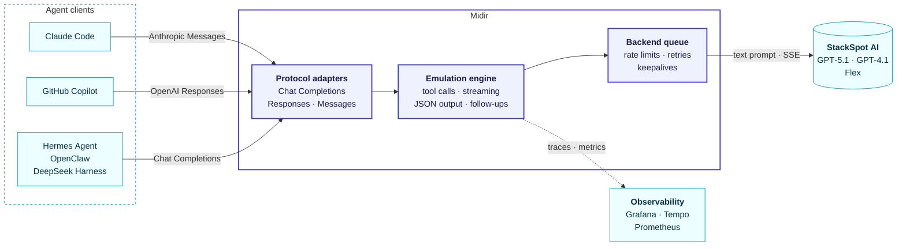

<p align="center">
  
</p>

<h1 align="center">MIDIR</h1>

<p align="center">
  <strong>One local endpoint for every agent client, on any LLM platform.</strong><br>
  An OpenAI- and Anthropic-compatible gateway that lets Claude Code, GitHub Copilot and other agents<br>
  use models they cannot talk to natively, with tool calling, streaming and structured output.
</p>

<p align="center">
  <a href="https://github.com/helton/midir/actions/workflows/ci.yml"></a>
  <a href="https://github.com/helton/midir/releases/latest"></a>
  <a href="https://github.com/helton/midir/pkgs/container/midir"></a>
  
  <a href="rust-toolchain.toml"></a>
  <a href="LICENSE"></a>
</p>

<p align="center">
  <a href="#quick-start">Quick start</a> ·
  <a href="#connect-your-client">Clients</a> ·
  <a href="#how-it-works">How it works</a> ·
  <a href="#documentation">Docs</a> ·
  <a href="docs/CHANGELOG.md">Changelog</a>
</p>

---

Agent platforms often expose their models through an API of their own: plain text in, plain text out. Coding agents
expect OpenAI or Anthropic APIs, with tools, roles and streaming. **Midir sits in between**: clients talk to it as if
it were a native provider, and Midir turns each request into what the platform understands, then turns the answer
back into tool calls, streaming events and usage, in each protocol's own format.

Backends are pluggable. Today Midir serves **StackSpot AI** agents (GPT-5.1, GPT-4.1 and StackSpot's Flex side by
side), and the request's `model` picks which one answers.

## Highlights

- **Three APIs, one endpoint**: OpenAI Chat Completions, OpenAI Responses (with `previous_response_id`) and Anthropic
  Messages, streaming or not, each with its own events, errors and usage.
- **Tool calling on text-only models**: tools, parallel calls and `tool_choice` emulated on top of the backend, with
  lenient JSON parsing and a repair round for broken calls, so agents run multi-step tasks end to end.
- **Agents that finish the job**: hidden follow-ups when a model announces an action without doing it, with strict
  rules: never confirming for the user what they did not order, never looping on a failed call.
- **Built for shared quotas**: a queue per backend with concurrency and rate limits, backoff on 429, and keepalives
  for backends that take a minute to start.
- **Observable**: OpenTelemetry traces and metrics, a ready-made Grafana dashboard and a proxy view of every request
  in one `docker compose` command; Prometheus `/metrics` without a collector.
- **Small and fast**: one static Rust binary, a 5 MB image (amd64 and arm64), 10 MB of memory at rest, about a
  millisecond of overhead per request.

## How it works



Each request is decoded into one canonical form, so every protocol gets the same emulation: the conversation and the
tool list become a prompt, the model's text is parsed back into tool calls as it streams, and the result is encoded
in the client's protocol. Details: [docs/architecture.md](docs/architecture.md).

## Quick start

You need Docker, a StackSpot client key (client id and secret of your realm) and at least one agent configured as in
[docs/backends/stackspot.md](docs/backends/stackspot.md).

```bash
git clone https://github.com/helton/midir && cd midir
cp .env.example .env                                # credentials and agent ids
cp config/midir.example.toml config/midir.toml      # backends and models
mkdir -p docker/data/gateway
printf 'UID=%s\nGID=%s\n' "$(id -u)" "$(id -g)" > docker/.env   # the container runs as you
docker compose -f docker/compose.yml up -d          # pulls ghcr.io/helton/midir
curl -s http://127.0.0.1:18880/ready                # {"ok": true, ...} once the credentials work
```

Point your client at `http://127.0.0.1:18880/v1` (Anthropic clients: `http://127.0.0.1:18880`). Any API key works,
unless you set `MIDIR_API_KEY`.

<details>
<summary><strong>With the observability stack</strong> (mitmproxy + Grafana)</summary>

```bash
docker compose -f docker/compose.yml -f docker/compose.observability.yml up -d
```

Clients keep using port 18880. Every request and backend call shows up in mitmweb at
`http://127.0.0.1:18882/?token=gateway`, and the **midir** dashboard in Grafana at `http://127.0.0.1:18883`.
</details>

<details>
<summary><strong>From source</strong> (the Rust pinned in <code>rust-toolchain.toml</code>, installed by rustup)</summary>

```bash
cargo build --release      # target/release/midir, a single binary
./target/release/midir     # reads .env and config/midir.toml from the current directory; --help for the options
```
</details>

## Connect your client

Ready-to-use configurations live in [examples/clients/](examples/clients/):

| Client | API | Configuration |
|---|---|---|
| **Claude Code** | Anthropic Messages | [`claude-code/settings.json`](examples/clients/claude-code/settings.json): Opus, Sonnet and Haiku mapped to gpt-5.1, flex and gpt-4.1 |
| **GitHub Copilot** (VS Code) | OpenAI Responses | [`copilot/`](examples/clients/copilot/): one provider with every model |
| **Hermes Agent** | Chat Completions | [`hermes/`](examples/clients/hermes/) |
| **DeepSeek Harness** (`dsh`) | Chat Completions | [`deepseek-harness/`](examples/clients/deepseek-harness/) |
| **OpenClaw** | Chat Completions or Responses | [`openclaw/`](examples/clients/openclaw/) |

Validated end to end with Claude Code, GitHub Copilot CLI, Hermes Agent, DeepSeek Harness and OpenClaw on every
model (multi-file edits, test runs and commits); GitHub Copilot in VS Code is in daily use. Agents running on top of
Midir can read [docs/agent-brief.md](docs/agent-brief.md) to learn what the emulation means for them.

## Configuration

Models are declared once and routed by name. A minimal `config/midir.toml`:

```toml
default_model = "gpt-5.1"

[backends.stackspot]
type = "stackspot"
realm = "${STACKSPOT_REALM}"                 # secrets stay in .env
client_id = "${STACKSPOT_CLIENT_ID}"
client_secret = "${STACKSPOT_CLIENT_SECRET}"

[[models]]
name = "gpt-5.1"
target = "${STACKSPOT_GPT_5_1_AGENT_ID}"     # the StackSpot agent that serves it
aliases = ["claude-opus-4-5"]                # names some clients send by default
```

Every setting can be overridden by an environment variable. Routing rules, variables and security:
[docs/configuration.md](docs/configuration.md).

## Performance

Measured against a local StackSpot stand-in, so only Midir's own cost counts:

| | |
|---|---|
| Image | ~12 MB, ~5 MB compressed (amd64, arm64) |
| Memory | ~10 MB at rest; ~100 MB with 32 concurrent 230 KB requests, most of it given back within seconds |
| Startup | under 100 ms |
| Overhead | ~1 ms per small request; ~11 ms for a 230 KB Copilot request with 36 tools |
| Throughput | 600+ requests/s with 32 concurrent 230 KB requests (the backend allows 100 per minute) |

## Documentation

| Guide | What it covers |
|---|---|
| [Configuration](docs/configuration.md) | files, models and routing, environment variables, security |
| [API compatibility](docs/compatibility.md) | endpoints, what is native-like, what is emulated with caveats, backend limits |
| [Operations](docs/operations.md) | ports, images and versions, telemetry, logs, troubleshooting |
| [Architecture](docs/architecture.md) | how a request flows, the emulation engine, adding a backend |
| [StackSpot backend](docs/backends/stackspot.md) | agents, credentials, limits and quirks |
| [Agent brief](docs/agent-brief.md) | for agents that run on Midir: what to expect |
| [Development](docs/development.md) | building, testing, repository layout, releases |
| [Changelog](docs/CHANGELOG.md) | what changed in each version |

## Why "Midir"?

In Irish mythology, Midir is a king of the Tuatha Dé Danann who lives in the Otherworld and crosses into the world of
mortals; one of the tasks set for him is building a causeway across a bog, a road where there was none. Midir does the
same between agent clients and the platforms that do not speak their language. The logo is a triquetra, a Celtic knot of three
woven loops.

## License

[MIT](LICENSE)
